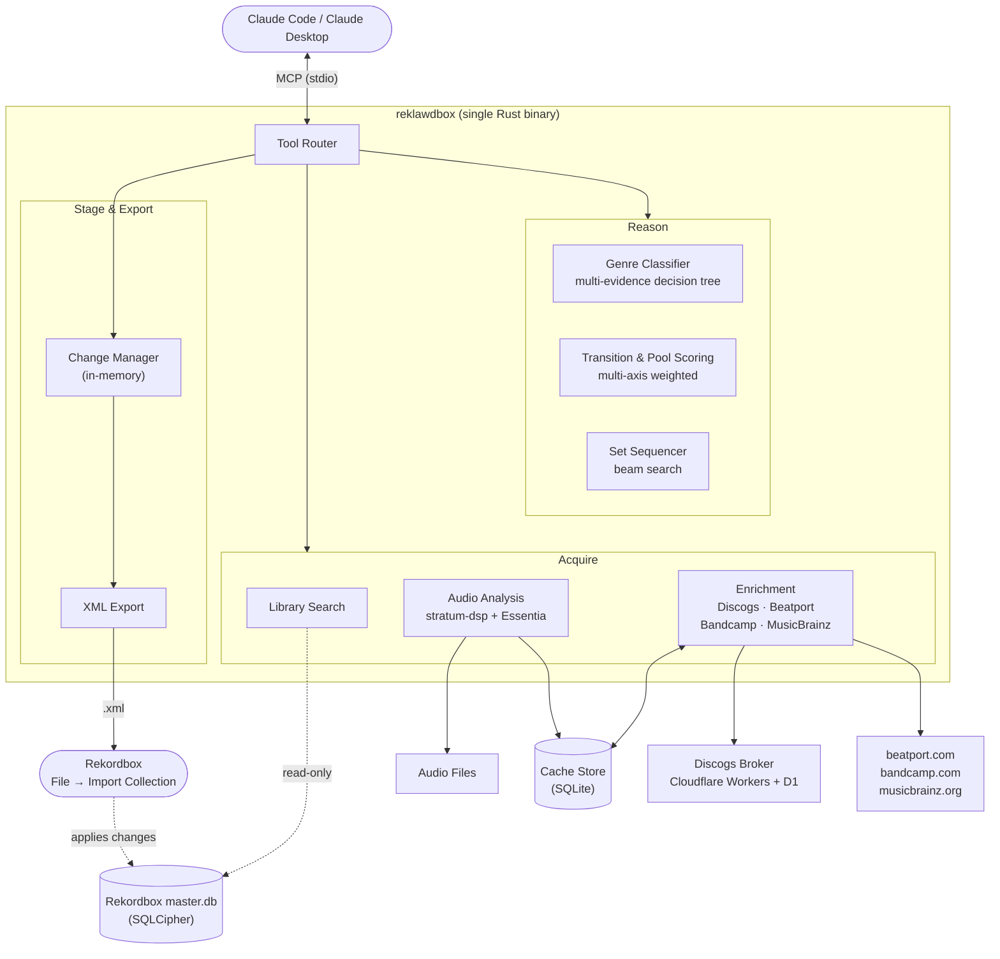

# reklawdbox

MCP server for [Rekordbox](https://rekordbox.com/) 7.x library management.
Gives an AI agent full read access to your encrypted Rekordbox database, stages
metadata edits in memory, and exports Rekordbox-compatible XML for safe
reimport. The database is never written to directly.

**Docs, workflows, and tool reference: [reklawdbox.com](https://reklawdbox.com)**

## How it works

You have a conversation with Claude. Claude calls reklawdbox tools to search
your library, analyze audio, look up metadata from external sources, classify
genres, score transitions, and build DJ sets. Proposed Rekordbox metadata
changes are held in memory until you explicitly export them as an XML file. You
then import that file into Rekordbox yourself. Separate tag and artwork tools
can write directly to audio files when called.

The result is an AI-assisted curation workflow where the agent handles the
tedious work (metadata lookups, genre classification, harmonic analysis, set
sequencing) while you choose which operations to authorize and what to import.

### Workflows

The server includes step-by-step SOPs (standard operating procedures) compiled
into the binary. Call `help()` in conversation to see the workflow menu.

| Workflow             | What it does                                                  |
| -------------------- | ------------------------------------------------------------- |
| Collection Audit     | Fix naming, tagging, and convention violations                |
| Metadata Backfill    | Fill missing labels, years, albums from enrichment            |
| Genre Classification | Classify ungenred tracks using enrichment + audio evidence    |
| Genre Audit          | Verify existing genre tags against evidence                   |
| Library Health       | Scan for broken links, orphans, duplicates, coverage gaps     |
| Set Building         | Sequence DJ sets with transition scoring and energy shaping   |
| Pool Building        | Discover clusters of compatible tracks for live improvisation |
| Chapter Set Planning | Plan multi-chapter sets with bridge tracks                    |
| Batch Import         | Tag, rename, and embed cover art for new music                |

## Architecture



### Key design decisions

- **Read-only database access.** The Rekordbox `master.db` is opened via
  SQLCipher with `SQLITE_OPEN_READ_ONLY`. No reklawdbox code path writes
  `master.db`.

- **Staged Rekordbox metadata.** Genre, comments, rating, color, label, year, and
  album changes made through `update_tracks` live in an in-memory
  `ChangeManager`. You can preview, modify, or discard them before XML export.

- **XML as the Rekordbox metadata path.** Rekordbox has no scripting API. The
  server generates
  Rekordbox-compatible XML that you import yourself via File → Import Collection.

- **Direct file operations.** Tag and artwork tools can write audio files or
  create extracted artwork. Tag writes support a dry run, but direct file tools
  do not share the in-memory `ChangeManager` or a universal rollback layer.

- **Separate local state.** Enrichment results, audio analysis, audit state,
  calibration data, and presets persist in a local SQLite database (WAL mode),
  separate from Rekordbox. Setup can also update host configuration, and XML
  exports and backups create local files. Cache entries are
  validated against the analysis schema plus the canonical audio file identity
  (path, size, and modification time). Stratum results also include a versioned
  fingerprint of the Rekordbox beat grid used for analysis, or of the no-grid
  fallback, so a grid change invalidates and recomputes only the Stratum result;
  Essentia freshness is independent of Rekordbox grid changes.

- **Host permissions remain independent.** Workflow review checkpoints are
  procedural. Keep the MCP host's normal permission checks enabled and scope
  approvals to the tools and music paths the workflow needs.

- **Two-tier audio analysis.** [stratum-dsp](https://github.com/ryan-voitiskis/stratum-dsp)
  (Rust, always available) handles BPM and key detection. [Essentia](https://essentia.upf.edu/)
  (Python, optional) adds energy, timbre, rhythm, and spectral features. All
  scoring axes degrade gracefully when Essentia is absent.

- **Broker-mediated enrichment.** Discogs API access is proxied through a
  [Cloudflare Workers service](broker/) that handles OAuth, rate limiting, and
  response caching. The Rust binary never holds Discogs consumer secrets.

- **SOPs compiled in.** Workflow procedures are embedded in the binary via
  `include_str!` so documentation can't drift from the release.

## Install

Requires macOS on Apple Silicon (M1 or later) and Rekordbox 7.x.

```bash
brew tap ryan-voitiskis/reklawdbox
brew install reklawdbox
```

Then run interactive setup:

```bash
reklawdbox setup
```

This installs Essentia (audio analysis), configures Claude Code and Claude
Desktop, and verifies the Rekordbox database connection. See the
[install guide](https://reklawdbox.com/getting-started/) for details.

## Build from source

Requires the [Rust toolchain](https://rustup.rs/) and Xcode Command Line Tools.

```bash
git clone https://github.com/ryan-voitiskis/reklawdbox.git
cd reklawdbox
cargo build --release
```

The binary is at `./target/release/reklawdbox`.

## CLI subcommands

The binary runs as an MCP server by default. Subcommands are available for local
workflows outside your MCP host:

| Subcommand          | Description                                            |
| ------------------- | ------------------------------------------------------ |
| `setup`             | Install Essentia and configure MCP hosts               |
| `hydrate`           | Batch enrichment + analysis (Discogs, Beatport, audio) |
| `analyze`           | Batch audio analysis (stratum-dsp + Essentia)          |
| `backup`            | Manage Rekordbox library backups                       |
| `read-tags`         | Read metadata tags from audio files                    |
| `write-tags`        | Write metadata tags to audio files                     |
| `extract-art`       | Extract embedded cover art from an audio file          |
| `embed-art`         | Embed cover art into audio files                       |
| `disconnect-broker` | Clear stored Discogs broker session                    |

Run `reklawdbox <subcommand> --help` for usage details.

## Development

```bash
cargo build --release
cargo test
cargo test -- --ignored        # integration tests
dprint fmt && cargo fmt        # format
dprint check && cargo fmt --check  # verify formatting
```

See [CONTRIBUTING.md](CONTRIBUTING.md) for expectations and workflow.

Agent-specific notes: [CLAUDE.md](CLAUDE.md), [AGENTS.md](AGENTS.md).

## Releasing

```bash
./scripts/release.sh 0.25.0
```

Tags and pushes. CI builds the binary, creates a GitHub Release, and updates the
[Homebrew tap](https://github.com/ryan-voitiskis/homebrew-reklawdbox).

## License

[MIT](LICENSE)
