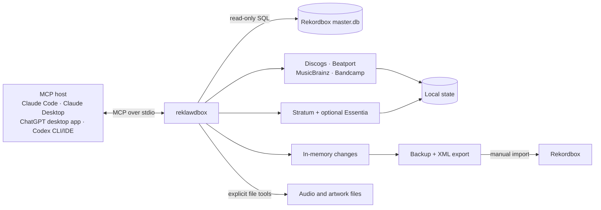

# reklawdbox

AI-assisted Rekordbox 7 library management for Apple Silicon Macs.

reklawdbox connects an MCP-capable AI host to your local Rekordbox library, so
you can inspect, clean, classify, and organize tracks through conversation. It
combines library data, online metadata, and audio evidence while keeping normal
Rekordbox metadata changes reviewable: the MCP server never performs SQL writes
to `master.db`; it stages changes in memory and exports XML for you to import.

Some explicit workflows can write audio tags, artwork, or other files. The
[safety model](#safety-model) below explains each boundary, including the
separate backup-restore command.

**[Documentation](https://reklawdbox.com) · [Install guide](https://reklawdbox.com/getting-started/) · [Workflow catalog](https://reklawdbox.com/workflows/) · [Tool reference](https://reklawdbox.com/mcp-tools/)**

## Why use it?

Maintaining a DJ library involves repetitive work across Rekordbox, audio
files, metadata sites, and listening notes. reklawdbox gives your AI host
purpose-built tools for that work while you choose the scope, review proposed
changes, and control what reaches Rekordbox.

You can use it to:

- understand your library, playlists, play history, and health;
- fill missing labels, years, albums, and genres;
- compare Discogs, Beatport, MusicBrainz, Bandcamp, and audio evidence;
- find compatible tracks already in your library and build ordered sets;
- prepare new downloads, tags, and artwork before Rekordbox import; and
- export approved metadata changes and playlists as Rekordbox XML.

## Quick start

### Requirements

- macOS on Apple Silicon (M1 or later)
- Rekordbox 7.x with at least one collection imported
- An MCP host for conversational use: Claude Code, Claude Desktop, the ChatGPT
  desktop app, Codex CLI, or the Codex IDE extension
- Python 3.9 or newer for `reklawdbox setup` and optional Essentia analysis

Python is not required for the built-in Stratum analysis or a manual MCP
configuration without Essentia.

### Install and connect

```bash
brew tap ryan-voitiskis/reklawdbox
brew install reklawdbox
reklawdbox setup
```

`setup` installs and validates the optional Essentia analysis backend,
configures Claude Code at `~/Music/.mcp.json`, configures Claude Desktop when
detected, and checks the Rekordbox database connection. Then reconnect your
host:

- **Claude Code:** start it from `~/Music`, then run `/mcp` or start a new
  conversation.
- **Claude Desktop:** quit and reopen the app.
- **OpenAI clients:** the ChatGPT desktop app, Codex CLI, and Codex IDE
  extension share MCP configuration. Add the server once in the ChatGPT desktop
  app under **Settings → MCP servers**, or from Codex CLI:

  ```bash
  codex mcp add reklawdbox -- /opt/homebrew/bin/reklawdbox
  ```

  Then restart the desktop app or IDE extension, or start a new Codex CLI
  session. Use `/mcp` to confirm that the server is connected.

If you built from source, run `./target/release/reklawdbox setup` and use that
binary's absolute path in your host configuration. To use reklawdbox without
Essentia, skip `setup` and follow the [manual configuration guide](https://reklawdbox.com/getting-started/#manual-configuration).

### Verify with one read-only request

Paste this into your connected MCP host:

```text
Use only reklawdbox's read_library tool. Show me:
- my total track and playlist counts
- my top genres
- my average BPM and key distribution

Do not call any other tool, use online services, analyze or modify audio files,
create or update caches, stage changes, create backups, or export XML. If
read_library is unavailable or fails, stop and tell me the error.
```

If you see your library summary, the connection works and nothing was changed.
Continue with the [first-session guide](https://reklawdbox.com/getting-started/first-session/)
or choose a goal below.

## Choose a goal

| I want to…                             | Start here                                                                     | Collection effect                         |
| -------------------------------------- | ------------------------------------------------------------------------------ | ----------------------------------------- |
| Check my library for problems          | [Library Health](https://reklawdbox.com/workflows/library-health/)             | Read-only checks                          |
| Fix missing or messy track information | [Library Cleanup](https://reklawdbox.com/workflows/library-cleanup/)           | Direct file fixes and staged XML          |
| Prepare new downloads                  | [Batch Import](https://reklawdbox.com/workflows/batch-import/)                 | Direct file work before Rekordbox import  |
| Add or check genre tags                | [Genre Classification](https://reklawdbox.com/workflows/genre-classification/) | Staged metadata, then XML                 |
| Build a set, crate, or full-night plan | [Set Building](https://reklawdbox.com/workflows/set-building/)                 | Read-only analysis; optional playlist XML |
| Plan a gig, dig, or practice session   | [DJ Prompts](https://reklawdbox.com/workflows/dj-prompts/)                     | Read-only planning                        |

For release-embedded, step-by-step SOPs, ask your agent to call `help()` without
a topic. The public workflow catalog also includes composite and planning
guides that are not separate runtime help entries.

## Safety model

Read-only Rekordbox access does not mean every operation is read-only. Know
which layer a workflow uses:

| Layer                      | What reklawdbox can do                                                                                                                                                                      | Your control point                                                                                                                       |
| -------------------------- | ------------------------------------------------------------------------------------------------------------------------------------------------------------------------------------------- | ---------------------------------------------------------------------------------------------------------------------------------------- |
| Rekordbox queries          | MCP tools and normal library operations open encrypted `master.db` with SQLite's read-only flag. They do not perform SQL writes.                                                            | No approval can turn these paths into database writes.                                                                                   |
| Staged Rekordbox metadata  | Genre, comments, rating, color, label, year, and album changes live in memory. A successful `write_xml` exports all pending changes, plus any requested playlists, after a database backup. | Run `preview_changes` before every export, including playlist-only work. Clear unwanted changes or import the XML manually in Rekordbox. |
| Audio and other user files | Explicit tag/artwork tools and workflow-approved host filesystem actions can write files outside Rekordbox. These do not use the staging layer.                                             | Use dry runs where available, test a small scope, and keep suitable audio-file backups.                                                  |
| Reklawdbox-owned state     | Enrichment and analysis caches, audit state, calibration data, presets, broker-session metadata, configuration, backups, and XML exports persist outside `master.db`.                       | Treat these as local application data and review output/configuration paths.                                                             |
| Backup restore             | `reklawdbox backup --restore` is a separate recovery command that can replace Rekordbox database/configuration files from an archive after typed confirmation.                              | Close Rekordbox, verify the archive, and use this only as an intentional restore.                                                        |

Staged changes disappear when the MCP process ends unless exported. A failed
backup or XML write restores the in-memory snapshot for retry; a successful
export clears the exported snapshot.

Keep your MCP host's normal permission checks enabled. Workflow approval steps
are guidance for the agent, not a universal runtime confirmation layer for
direct file tools.

See [Safety & Trust](https://reklawdbox.com/concepts/safety/) and [XML Export](https://reklawdbox.com/reference/xml-export/) for the full operating
model and current Rekordbox import steps.

## How it works



- **Audio analysis:** the built-in [stratum-dsp](stratum-dsp/) backend provides
  tempo/key confidence, beat-grid, rhythm, decay, and structure evidence.
  Optional [Essentia](https://essentia.upf.edu/) adds loudness, danceability,
  onset, timbral, and spectral evidence. Scoring derives energy only when the
  required Essentia inputs exist; otherwise it uses a BPM-based proxy.
- **Enrichment:** Discogs access goes through the open-source
  [broker](broker/), which handles OAuth, rate limiting, and response caching
  without putting Discogs consumer secrets in the Rust binary. Other providers
  are queried directly for specific metadata evidence. Library search,
  classification, scoring, and audio analysis stay local; an uncached provider
  lookup sends identifying track metadata to that selected service and caches
  the result locally.
- **Workflow guidance:** the site and each released binary share the same SOP
  partials. Each release therefore carries the workflow text built with it.

Read the [architecture guide](https://reklawdbox.com/concepts/architecture/)
for cache freshness, scoring, provider, and data-flow details.

## CLI

Most DJ workflows happen through the connected AI host. MCP hosts launch the
binary over piped stdin; in an interactive terminal, use CLI subcommands for
setup, bulk processing, backups, and direct file work.

| Subcommand          | Description                                                                |
| ------------------- | -------------------------------------------------------------------------- |
| `setup`             | Install Essentia, configure supported Claude hosts, and check the database |
| `hydrate`           | Warm Discogs, Beatport, and audio-analysis caches in bulk                  |
| `analyze`           | Run batch audio analysis only                                              |
| `backup`            | Create, list, or explicitly restore Rekordbox backups                      |
| `read-tags`         | Read metadata tags from audio files                                        |
| `write-tags`        | Write metadata tags to audio files                                         |
| `extract-art`       | Extract embedded artwork to a file                                         |
| `embed-art`         | Embed artwork into audio files                                             |
| `disconnect-broker` | Clear the stored Discogs broker session                                    |

Run `reklawdbox <subcommand> --help` or see the [CLI reference](https://reklawdbox.com/cli/) for flags, defaults, and examples.

## Build and develop

Build from source with the [Rust toolchain](https://rustup.rs/) and Xcode
Command Line Tools:

```bash
git clone https://github.com/ryan-voitiskis/reklawdbox.git
cd reklawdbox
cargo build --release
./target/release/reklawdbox --version
```

The full local verification path is:

```bash
cargo fmt --check
dprint check
cargo clippy --workspace --all-targets -- -D warnings
cargo test --workspace --no-fail-fast
cargo build --release
./target/release/reklawdbox --version
./target/release/reklawdbox --help
node scripts/mcp-smoke.mjs --bin ./target/release/reklawdbox --skip-db
```

The repository contains the root Rust MCP/CLI crate, the `stratum-dsp/`
workspace crate, the Astro documentation site in `site/`, and the Cloudflare
Discogs broker in `broker/`. See [src/README.md](src/README.md) for the code map
and [CONTRIBUTING.md](CONTRIBUTING.md) for contribution expectations.

## Releasing

Maintainers pass a new semantic version to [`scripts/release.sh`](scripts/release.sh)
from a clean `main`. The script runs the release preflight, uses a DB-backed MCP
smoke test by default, bumps and commits version files, tags the commit, and
pushes `main` plus the tag. Set `REKLAWDBOX_RELEASE_SKIP_DB_SMOKE=1` only when
the DB-free smoke is required. Tag CI publishes the Apple Silicon GitHub
release and updates the [Homebrew tap](https://github.com/ryan-voitiskis/homebrew-reklawdbox).

## License

[MIT](LICENSE)
