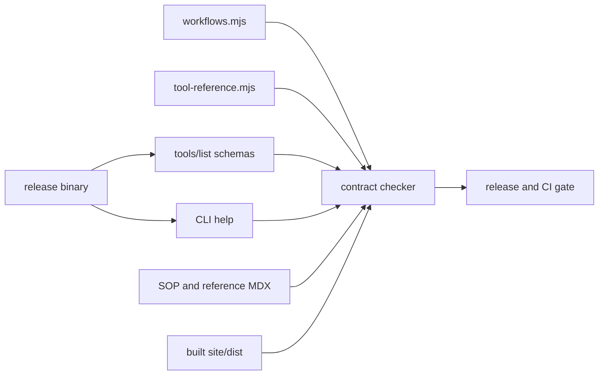

# Plan 027: Automate code-backed documentation contracts

> **Executor instructions**: Follow this plan in order. Build red fixture tests
> before correcting known drift, and confirm every expected result. If a STOP
> condition occurs, report it rather than adding a broad exception. Update this
> plan's row in `plans/README.md` only when the orchestrator/reviewer does not
> own the index.
>
> **Drift check (run first)**:
>
> ```bash
> git diff --stat 3451803..HEAD -- src/tools src/cli src/main.rs scripts/mcp-smoke.mjs scripts/release.sh .github/workflows/docs-pages.yml docs/workflows/doc-drift site/src/content/docs/mcp-tools site/src/content/docs/cli site/src/partials/sops site/src/data/workflows.mjs site/astro.config.mjs
> ```
>
> Plan 026's workflow module must be present. Re-enumerate the live MCP and CLI
> surfaces before designing a parser. A checker that needs a private Rekordbox
> DB, duplicates the complete tool schema by hand, or can pass only through
> page-wide allowlists is a STOP condition.

## Status

- **Priority**: P1
- **Effort**: M
- **Risk**: MED
- **Depends on**: 026
- **Category**: tests / docs / DX
- **Planned at**: commit `3451803`, 2026-07-12

## Why this matters

Documentation drift is currently detected by a manual audit prompt. The release
flow accepts an environment acknowledgement in place of evidence, the docs CI
only builds Astro, and the MCP smoke checks three tools plus one help phrase.
As a result, wrong tool counts, undocumented parameters, stale CLI flags,
invalid SOP calls, and dead runtime-help URLs can ship while every existing
gate is green.

This plan adds a deterministic, DB-free contract checker for facts the runtime
can prove. Narrative accuracy and current third-party UI instructions remain a
manual review responsibility.

## Current state

- `docs/workflows/doc-drift/prompt.md:42-87` describes manual cross-checks and
  finishes with a site build.
- `scripts/release.sh:71-88` accepts `REKLAWDBOX_DOC_DRIFT_DONE=1` rather than
  executing evidence-producing checks.
- `.github/workflows/docs-pages.yml:3-13,37-43` watches mainly `site/**` and only
  builds the documentation.
- `scripts/mcp-smoke.mjs` checks required tool names, genre/audit help, the
  playlist-import guidance for set/pool/chapter, and protocol violations; it
  already proves a DB-free stdio handshake is possible.
- At the planning baseline the release binary advertises 53 tools while
  `site/src/content/docs/mcp-tools/index.mdx` says 51. Its Classification &
  Staging group contains 13 live tools while the page says 11.
- `src/tools/help_handler.rs:206-220` links `/reference/tools/`; the built site
  uses `/mcp-tools/`.
- Plan 026 creates the canonical ordered workflow records. Consume them; do not
  re-enter workflow order in this checker.

## Commands you will need

| Purpose            | Command                                                                                     | Expected on success                               |
| ------------------ | ------------------------------------------------------------------------------------------- | ------------------------------------------------- |
| Build runtime      | `cargo build --release`                                                                     | exit 0                                            |
| Existing smoke     | `node scripts/mcp-smoke.mjs --bin ./target/release/reklawdbox --skip-db --timeout-ms 60000` | exit 0; reports the live tool count               |
| Checker unit tests | `node --test scripts/check-doc-contract.test.mjs`                                           | exit 0; positive and negative fixtures pass       |
| Live contract      | `node scripts/check-doc-contract.mjs --bin ./target/release/reklawdbox --dist ./site/dist`  | exit 0 after the mechanical baseline is corrected |
| Site               | `cd site && npm run build`                                                                  | exit 0                                            |
| Format             | `dprint check`                                                                              | exit 0                                            |

## Scope

**In scope**:

- `scripts/lib/mcp-stdio.mjs` — create
- `scripts/check-doc-contract.mjs` — create
- `scripts/check-doc-contract.test.mjs` — create
- `scripts/mcp-smoke.mjs`
- `scripts/release.sh`
- `.github/workflows/docs-pages.yml`
- `docs/workflows/doc-drift/README.md`
- `docs/workflows/doc-drift/prompt.md`
- `site/src/data/workflows.mjs` from Plan 026
- `site/src/data/tool-reference.mjs` — create as the small canonical
  tool-to-page/group mapping consumed by both the site and checker
- `site/src/content/docs/mcp-tools/index.mdx`
- the five `site/src/content/docs/mcp-tools/*.mdx` reference pages, but only for
  structural contract corrections exposed by the checker
- `site/src/content/docs/cli/index.mdx`
- `src/tools/help_handler.rs` for the dead route and machine-checked workflow
  ordering only
- `src/tools/tests.rs` for focused public-help contract tests
- `plans/README.md` for the status row only

**Out of scope**:

- Proving narrative handler semantics or current external-link availability.
- Changing an MCP tool, parameter, default, CLI behavior, or workflow to make
  stale prose true.
- Private Rekordbox data, audio fixtures, provider credentials, or network
  calls.
- A general MDX parser or full documentation linter.
- Human/agent Pagefind, sitemap, and LLM-output policy; Plan 031 activates those
  checks using this script's extension points.
- The final remaining narrative correction set; Plan 032 owns it.

## Git workflow

- Branch: `codex/027-automate-documentation-contracts`
- Preferred commit: `test(docs): enforce public contract drift checks`.
- Do not push or open a PR unless explicitly instructed.

## Required checker architecture

The checker must derive facts from live or canonical inputs:



`tool-reference.mjs` maps every live tool name to exactly one
group and reference route. It must not copy schemas, parameter lists, defaults,
or descriptions. The live `tools/list` response remains canonical for those.

## Steps

### Step 1: Extract a reusable DB-free MCP stdio client

Move initialization, JSON-RPC request IDs, response matching, stderr capture,
timeouts, and child cleanup from `scripts/mcp-smoke.mjs` into
`scripts/lib/mcp-stdio.mjs`. Preserve the smoke CLI and its success/failure
behavior. The helper must always terminate the child on success, error, and
timeout and must not print the child's environment. Its `tools/list` helper
must return the unmodified result payload, including every live `inputSchema`;
callers such as the smoke script may project names only after receiving that
canonical object.

Add unit seams for feeding protocol lines without starting a process. Keep the
module dependency-free.

**Verify**:

```bash
cargo build --release
node scripts/mcp-smoke.mjs --bin ./target/release/reklawdbox --skip-db --timeout-ms 60000
```

Expected: both commands exit 0 with the same handshake/help behavior and live
tool count; the smoke does not access a user library.

### Step 2: Define the minimal tool mapping

Create `site/src/data/tool-reference.mjs`. It must contain one entry per live
tool with `name`, `group`, and `route`. Render group totals and the overall total
in `mcp-tools/index.mdx` from this module so numeric prose cannot drift
independently.

Validate duplicate/missing names and legal routes at import time. Compare the
mapping set with `tools/list`; extra or missing entries fail with a sorted
diagnostic.

**Verify**:

```bash
node -e "import('./site/src/data/tool-reference.mjs').then(m => { m.validateToolReferences(m.toolReferences); console.log(m.toolReferences.length) })"
```

Expected: exit 0 and print the live mapped tool count with no duplicate name,
group, or route error. Do not proceed if the count differs from the Step 1
`tools/list` result.

### Step 3: Build fixture-tested structural parsers

In `scripts/check-doc-contract.test.mjs`, cover the parsing helpers before the
live checker is made green. The tests must prove failures for:

- missing and extra tool mappings;
- a mapped tool or CLI subcommand with no marked contract surface;
- documented parameter name not present in JSON Schema;
- live schema property omitted from the marked documentation surface;
- a reusable shared surface composed with a tool-local surface, plus a live
  property omitted from that composed union;
- an unknown or cyclic shared-surface include and a conflicting duplicate
  field across included/local surfaces;
- schema-global required/optional mismatch, plus a conditional-requiredness
  fixture proving contextual labels are not compared to the global array;
- primitive, array/object, enum, or documented default drift when exposed by
  the schema;
- an unknown MCP tool or named top-level argument in an SOP code block;
- missing/extra CLI subcommand or flag;
- missing workflow ID/route or noncanonical order;
- an internal link and runtime-help URL whose built target is absent.

Bracket **every** MCP or CLI table the checker consumes with a small invisible
contract marker. Parse no arbitrary MDX tables. An MCP marker must identify the
tool, schema path, and requiredness mode, for example:

```md
<!-- doc-contract:mcp tool=update_tracks schema=/properties/changes/items requiredness=conditional -->

...one checked table...

<!-- /doc-contract:mcp -->
```

Use JSON Pointer-like schema paths for nested public structures such as playlist
items or change objects. `requiredness=global` compares the table to the JSON
Schema object's formal `required` array. `requiredness=conditional` validates
name, type, enum, and exposed default but does **not** compare required/optional
labels unless the schema formally expresses that condition. Mode-dependent
requirements for `audit_state` and mutually exclusive pool-scoring shapes
remain semantic review; never infer them from descriptions or maintain a
per-tool exception list.

Shared parameter tables must remain reusable rather than being copied into
every tool table. Bracket one canonical table with a named marker such as:

```md
<!-- doc-contract:mcp-surface name=shared-search-filters schema=/ requiredness=global -->

...one checked reusable table...

<!-- /doc-contract:mcp-surface -->
```

A tool marker may declare `include=shared-search-filters` (or a comma-separated
list of named surfaces). Resolve each included surface against that tool's live
schema at the surface's declared schema path, then union included and local
fields before checking completeness. The shared marker is documentation reuse,
not a second schema oracle: every included field is still checked against each
consumer's live schema. Reject unknown or cyclic includes. Reject conflicting
duplicate fields across local/included surfaces; exact duplicate declarations
may be deduplicated only when their checked name, type, enum/default, schema
path, and requiredness semantics agree. Fixture successful composition, an
omitted live field from the final union, an unknown include, a cycle, and a
conflicting duplicate. This composition rule is required for the existing
shared-filter table used by multiple tool schemas.

CLI tables receive equivalent explicit markers naming the root or subcommand
and the checked surface. Compare marked inventories to stdout. Exclude only
Clap-generated `-h`/`--help`, root `-V`/`--version`, and the synthetic root
`help` subcommand globally unless the docs choose to document them. Do not run
`reklawdbox help --help`; it is not an application subcommand and currently
exits 2. Treat the current version banner on stderr as benign only when an
application help process exits zero.

For tools or subcommands with no public parameters/options, use a self-contained
empty marker instead of inventing a table, for example
`<!-- doc-contract:mcp tool=read_library schema=/ surface=none requiredness=global -->`
or `<!-- doc-contract:cli command=disconnect-broker surface=none -->`. The
checker must prove the declared live surface is empty after the global generated
Clap exclusions. Add positive and false-empty fixtures.

For SOPs, do not add markers or edit the partials. Recognize only unlabelled
fences whose first nonblank token is either a lowercase snake_case `name(` call
or an exact bare lowercase snake_case live tool name with a zero-parameter
schema, such as `read_library`. Scan balanced parentheses/brackets/braces and
quoted strings, support multiple calls per fence, and extract only top-level
`name=` arguments. Positional operation forms such as `audit_state(scan, ...)`,
nested objects/arrays, ellipses, the bare no-argument form, and output prose need
explicit fixtures. Ignore labelled `sh`, `bash`, JSON/output, and illustrative
fences. This is a bounded call recognizer, not a general MDX parser.

Resolve local JSON Schema `$ref` entries and normalize obvious type forms.
Defaults should be checked only when the runtime schema/Clap help exposes them.

**Verify**:

```bash
node --test scripts/check-doc-contract.test.mjs
```

Expected: exit 0; every positive fixture passes and each deliberately malformed
fixture is asserted to produce its specific diagnostic.

### Step 4: Implement the live checker

`scripts/check-doc-contract.mjs` must:

1. accept `--bin` and `--dist`, with repository-relative defaults;
2. start MCP without a DB and call `tools/list`;
3. compare the complete live tool set to the tool mapping/reference pages;
4. compare only explicitly marked local/reusable parameter tables to live
   schemas at their declared schema paths, composing named includes before the
   completeness check and respecting global versus conditional requiredness;
5. validate tool calls and named top-level arguments in embedded SOP partials;
6. execute `reklawdbox --help` plus every application subcommand's `--help`,
   excluding Clap's synthetic root `help`, and compare inventories to explicitly
   marked CLI surfaces with only the documented global Clap exclusions;
7. validate Plan 026's eleven site workflow IDs/routes/order, then separately
   derive the nine `runtimeHelp` menu records and seven non-null
   `recommendedOrder` records; compare the live `help()` menu and numbered
   sequence to those subsets without making the two non-SOP pages runtime help;
8. scan built HTML for internal links and verify every
   `https://reklawdbox.com/...` URL emitted by runtime help has a built route;
9. print deterministic `file:line`/tool/field diagnostics and exit nonzero on
   any mismatch.

The checker must not invoke a provider, read `master.db`, inspect credentials,
or use a network connection.

**Verify**:

```bash
cd site && npm run build && cd ..
if node scripts/check-doc-contract.mjs --bin ./target/release/reklawdbox --dist ./site/dist; then
  printf 'expected the known baseline drift to fail\n' >&2
  exit 1
fi
```

Expected at this step: the checker exits nonzero and names the known
`/reference/tools/` route plus any remaining structural mismatches with source
locations. Step 2 may already have removed the hard-coded count mismatch by
rendering from canonical data. A crash, provider call, or DB error is not an
acceptable failure.

### Step 5: Correct only the mechanical baseline

Run the new checker expecting it to fail. Correct the structural drift it
proves, including:

- live total/group counts through the canonical mapping;
- `/reference/tools/` to `/mcp-tools/` in runtime help;
- the nine-entry help menu and seven-entry recommended sequence derived from
  Plan 026's `runtimeHelp` fields, kept distinct from the 11-page site catalog;
- strictly structural missing/extra tool names, parameters, required markers,
  CLI entries, workflow routes, or internal links.

For each unexpected narrative mismatch, open a follow-up or leave it for Plan
032. Do not change runtime behavior or broaden scope merely to achieve green.
Add focused Rust assertions for the runtime-help route, topic/menu shape, and
DB-free behavior. Do not copy the 9/7 ordering into a second Rust test
inventory; the Node live checker owns order comparison against the canonical
module.

**Verify**:

```bash
cargo test -p reklawdbox help_public_contract -- --nocapture
cd site && npm run build && cd ..
node scripts/check-doc-contract.mjs --bin ./target/release/reklawdbox --dist ./site/dist
```

Expected: all commands exit 0; help uses `/mcp-tools/`, the separate 9-menu and
7-recommended orders pass against the module, and the previous structural
diagnostics are gone.

### Step 6: Make release and docs CI execute evidence

In `scripts/release.sh`:

- expand the docs-sensitive predicate to cover MCP annotations/params, CLI
  definitions, help, SOPs, README, workflow/tool data, and contract scripts;
- build the site and run the checker against the release binary;
- remove `REKLAWDBOX_DOC_DRIFT_DONE` as a bypass;
- retain a reminder/link for the semantic audit when narrative changes demand
  human review.

In `.github/workflows/docs-pages.yml`:

- trigger on the same code-backed paths, not only `site/**`;
- install/cache Rust and Node dependencies;
- build the runtime binary without private data;
- run Node fixture tests, build the site, then run the live checker before
  upload/deploy;
- preserve least-privilege permissions and existing Pages behavior.

**Verify**:

```bash
bash -n scripts/release.sh
! rg -n "REKLAWDBOX_DOC_DRIFT_DONE" scripts/release.sh
rg -n -e "check-doc-contract" -e "src/tools" -e "src/cli" -e "site/src/partials/sops" .github/workflows/docs-pages.yml scripts/release.sh
```

Expected: shell syntax passes, the bypass has no matches, and both release and
CI show the executable gate plus code-backed trigger paths. Review the workflow
permissions block remains no broader than the baseline.

### Step 7: Document what the gate does and does not prove

Update the doc-drift README/prompt so maintainers run the automated gate first
and then review semantics that cannot be derived mechanically: workflow intent,
external Rekordbox UI, risks, recovery advice, and user-facing clarity.

Document how later plans add fields/assertions without copying canonical data.
Specifically reserve extension points for Plan 028's continuation fields and
Plan 031's generated-audience outputs.

**Verify**:

```bash
rg -n -e "automated" -e "semantic" -e "check-doc-contract" -e "continuation" -e "generated.*output" docs/workflows/doc-drift/README.md docs/workflows/doc-drift/prompt.md
```

Expected: exit 0; the docs distinguish executable checks from semantic review
and name both later extension classes.

### Step 8: Run the complete gate twice

Run unit tests and the live checker, deliberately break one fixture/copy in the
test harness to demonstrate a nonzero result, restore it, then run the normal
Rust/site gates. Inspect CI YAML and release diff for accidental secret/env
output.

**Verify**:

```bash
node --test scripts/check-doc-contract.test.mjs
cargo fmt --check
dprint check
cargo clippy -p reklawdbox --all-targets -- -D warnings
cargo test -p reklawdbox --no-fail-fast
cargo build --release
cd site && npm run build && cd ..
node scripts/check-doc-contract.mjs --bin ./target/release/reklawdbox --dist ./site/dist
node scripts/mcp-smoke.mjs --bin ./target/release/reklawdbox --skip-db --timeout-ms 60000
```

Expected: every command exits 0 after the deliberate negative fixture is
restored; no output contains an environment dump or credential value.

## Test plan

- Pure Node fixtures cover success and every required failure class.
- The actual release binary supplies live schemas and CLI help without a DB.
- Focused Rust tests protect runtime-help route/topic/menu shape; Node compares
  the live menu/recommended order with the canonical module.
- Built-route/link checks run against `site/dist`, not source guesses.
- Existing MCP smoke behavior remains intact.
- No test reads a private library, audio file, Keychain, or provider network.

## Done criteria

- [ ] A complete live tool mapping and reference inventory agree exactly.
- [ ] Marked MCP parameters, named reusable surfaces, composed completeness,
      and schema-global requiredness are checked; contextual requiredness
      remains explicitly semantic.
- [ ] Missing documented properties, false empty surfaces, bare no-argument SOP calls, and synthetic Clap help are covered by fixtures.
- [ ] SOP tool calls/named arguments and CLI inventories are checked.
- [ ] The 11-page catalog, 9-entry runtime menu, and 7-step recommended order are separately derived from Plan 026's module and checked.
- [ ] Runtime-help site URLs resolve in the built site.
- [ ] Release has no environment-variable bypass for the mechanical check.
- [ ] Docs CI watches code-backed contract paths and executes the checker.
- [ ] Unit fixtures, Rust tests, MCP smoke, site build, live checker, and format pass.
- [ ] The gate requires no DB, credentials, audio, or network.
- [ ] No files outside Scope are modified, except `plans/README.md` status.

## STOP conditions

Stop and report back if:

- Plan 026 has no consumable canonical workflow module.
- A live inventory cannot be obtained without a real Rekordbox database.
- The proposed solution copies the whole live schema into a snapshot.
- MDX validation requires broad exceptions or a general-purpose parser rewrite.
- A structural mismatch actually requires a behavior/product decision.
- CI cannot run the DB-free binary without new secrets.
- The release flow has materially changed from the recorded evidence.

## Maintenance notes

- Keep the checker deterministic, dependency-light, and actionable.
- New tools must update the small mapping/reference, not a schema mirror.
- New CLI flags and workflow routes must fail the gate until documented.
- Narrative semantic review remains mandatory when behavior or user guidance
  changes; a green structural gate is not proof of complete accuracy.
