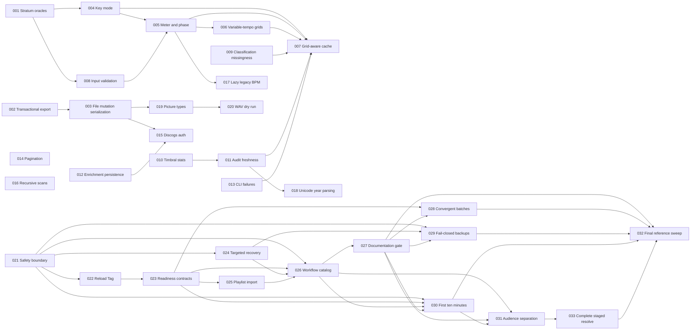

# Reklawdbox Improvement Plans

The original Plans 001–020 were generated by the `improve` skill on
2026-07-10 from commit `e6eb382` and cover the vetted Rust correctness,
concurrency, cache, testing, safety, and performance findings from that audit.
Plans 021–033 were added on 2026-07-12 from commit `3451803` after a deep
accuracy and discovery audit of the Astro documentation site. They cover ten
documentation/runtime contract findings and three coordinated UX directions.
No source change is part of either planning set.

Each executor must read its assigned plan in full before changing code, run the
plan's drift check first, honor every STOP condition, and update the matching
status row below when finished. An orchestrator or reviewer that owns this
index may instead update statuses after independently reviewing the executor's
diff and rerunning the plan's done criteria.

## Orchestrator operating protocol

Before creating worktrees, make this planning set available from the portfolio
base. If `plans/` is still untracked, either obtain authorization to commit it
as a plan-only Conventional Commit or copy the exact assigned plan into each
worktree and keep this index in the orchestrator's control worktree. A worktree
created directly from either planning SHA will not contain untracked plan
files.

1. Start each plan in an isolated worktree on the branch named in that plan.
2. Base a dependent plan on a reviewed composite containing every dependency,
   not on the original planning SHA. A dependency's own reviewed ancestors must
   be present transitively.
3. Plans in the same wave may run concurrently only in isolated worktrees.
   The graph orders every known production-file overlap. Append-only overlap in
   `src/tools/tests.rs` or docs may be developed in parallel, but integrate
   reviewed branches one at a time. If a conflict is more than an
   additive test/doc/status merge, rebase the later executor branch on the
   current reviewed result and rerun its drift check and full verification.
4. Integrate reviewed plan commits in dependency order into one portfolio
   branch. Never resolve a behavioral conflict by dropping either plan's tests
   or contract; STOP and redispatch the later plan from the integrated base.
5. The orchestrator owns this index during parallel execution: tell executors
   not to edit it, set a row to `IN PROGRESS` at dispatch, record
   `BLOCKED: <reason>` on a STOP condition, and set `DONE` only after review,
   integration, and rerun verification.
6. Treat executor output as untrusted: inspect every diff, confirm it stays
   within Scope, and rerun all targeted and full verification commands before
   marking a plan DONE.
7. Preserve the read-only Rekordbox `master.db` boundary. User-visible metadata
   changes must continue through `ChangeManager` and XML export; local cache
   SQLite writes remain allowed.
8. Use Conventional Commits. Do not push, open a PR, deploy locally, or release
   unless the operator separately authorizes that action.
9. If a plan changes MCP tools, parameters, SOPs, CLI flags, or README claims,
   run the doc-drift workflow in `docs/workflows/doc-drift/README.md` before the
   portfolio's final gate.
10. Every concurrency/cancellation regression must bound its complete scenario
    and each barrier, notification, channel/oneshot receive, and spawned-task
    join with a short Tokio timeout. Use deterministic signaling rather than
    sleeps, and shut down or abort fixture/writer tasks on every exit path so a
    broken implementation fails instead of hanging `cargo test`.

## Plan index and status

Plan numbers are stable identifiers, not a top-to-bottom execution order. Dispatch by
the dependency graph and recommended waves below.

| Plan                                                  | Title                                                    | Priority | Effort | Depends on                   | Status |
| ----------------------------------------------------- | -------------------------------------------------------- | -------- | ------ | ---------------------------- | ------ |
| [001](001-strengthen-stratum-success-oracles.md)      | Strengthen Stratum success oracles                       | P1       | M      | -                            | DONE   |
| [002](002-transactional-xml-export.md)                | Make XML export transactional                            | P1       | M      | -                            | DONE   |
| [003](003-serialize-audio-file-mutations.md)          | Serialize audio-file mutations                           | P1       | M      | 002                          | DONE   |
| [004](004-preserve-key-mode-evidence.md)              | Preserve key-mode evidence                               | P1       | M      | 001                          | DONE   |
| [005](005-infer-meter-and-downbeat-phase.md)          | Infer meter and downbeat phase from evidence             | P1       | L      | 004, 008                     | DONE   |
| [006](006-stabilize-variable-tempo-beat-grids.md)     | Stabilize variable-tempo beat grids                      | P1       | L      | 005                          | DONE   |
| [007](007-invalidate-stratum-cache-on-grid-change.md) | Invalidate Stratum cache when the Rekordbox grid changes | P1       | L      | 004, 005, 006, 009, 011, 013 | DONE   |
| [008](008-validate-stratum-analysis-inputs.md)        | Validate Stratum analysis inputs                         | P1       | L      | 001                          | DONE   |
| [009](009-preserve-classification-missingness.md)     | Preserve missingness in audio classification             | P1       | M      | -                            | DONE   |
| [010](010-version-timbral-normalization-stats.md)     | Version timbral normalization statistics                 | P1       | M      | -                            | DONE   |
| [011](011-make-audit-freshness-complete.md)           | Make incremental audit freshness complete                | P1       | M      | 010                          | DONE   |
| [012](012-acknowledge-enrichment-cache-writes.md)     | Acknowledge enrichment cache writes                      | P1       | M      | -                            | DONE   |
| [013](013-propagate-cli-batch-failures.md)            | Propagate CLI batch failures                             | P2       | M      | -                            | DONE   |
| [014](014-fix-selector-pagination-order.md)           | Apply pagination after selector filtering                | P2       | M      | -                            | DONE   |
| [015](015-serialize-discogs-device-auth.md)           | Serialize Discogs device-auth transitions                | P1       | M      | 003, 012                     | DONE   |
| [016](016-bound-recursive-audio-scan.md)              | Prevent recursive audio-scan symlink cycles              | P1       | M      | -                            | DONE   |
| [017](017-defer-legacy-bpm-fallback.md)               | Defer legacy BPM fallback work                           | P2       | S      | 005                          | DONE   |
| [018](018-make-year-suffix-unicode-safe.md)           | Make year-suffix parsing Unicode-safe                    | P2       | S      | 011                          | DONE   |
| [019](019-validate-cover-art-picture-types.md)        | Validate cover-art picture types                         | P2       | M      | 003                          | DONE   |
| [020](020-report-wav-dry-run-per-layer.md)            | Report WAV dry-run changes per layer                     | P2       | M      | 019                          | DONE   |
| [021](021-correct-safety-permission-guidance.md)      | State the real safety and permission boundary            | P1       | S      | -                            | DONE   |
| [022](022-add-reload-tag-handoff.md)                  | Add the Reload Tag synchronization handoff               | P1       | S      | 021                          | DONE   |
| [023](023-define-capability-readiness-contracts.md)   | Define workflow-specific readiness contracts             | P1       | M      | 022                          | DONE   |
| [024](024-preserve-internal-state-during-recovery.md) | Preserve internal state during targeted recovery         | P1       | S      | 021                          | DONE   |
| [025](025-document-playlist-xml-import.md)            | Document the playlist XML import path                    | P1       | S      | 023                          | DONE   |
| [026](026-publish-workflow-contract-catalog.md)       | Publish a canonical workflow contract catalog            | P1       | M      | 021, 023, 024, 025           | DONE   |
| [027](027-automate-documentation-contracts.md)        | Automate code-backed documentation contracts             | P1       | M      | 026                          | DONE   |
| [028](028-make-batch-workflows-convergent.md)         | Make bounded batch workflows convergent and resumable    | P1       | L      | 023, 027                     | DONE   |
| [029](029-make-export-backups-fail-closed.md)         | Make export backups fail closed and path-aware           | P1       | M      | 021, 024, 027                | DONE   |
| [030](030-create-first-ten-minutes-onboarding.md)     | Create a bounded first-ten-minutes onboarding journey    | P1       | M      | 021, 023, 026, 027           | DONE   |
| [031](031-separate-human-agent-publishing.md)         | Separate human and agent publishing surfaces             | P2       | L      | 026, 027, 030                | DONE   |
| [032](032-refresh-public-reference-contracts.md)      | Reconcile remaining public references and examples       | P2       | M      | 027, 028, 029, 030, 031, 033 | DONE   |
| [033](033-return-all-staged-fields-from-resolve.md)   | Return every staged editable field from resolve tools    | P1       | S      | 031                          | DONE   |

Status values: `TODO` | `IN PROGRESS` | `DONE` | `BLOCKED: <reason>` |
`REJECTED: <rationale>`.

## Documentation-audit coverage

- Immediate correctness: 021 safety/permissions, 022 Reload Tag handoff, 023
  provider/readiness contracts, 024 targeted internal-state recovery, and 025
  playlist XML import.
- Durable correctness: 027 automated contract enforcement, 028 convergent batch
  continuation, 029 fail-closed path-aware backup, and 032 the final integrated
  reference/example sweep.
- UX directions: 026 makes workflow differences comparable before selection,
  030 creates a bounded first connected session, and 031 separates human
  discovery from model-facing SOP publication.

The UX plans consume the corrected contracts rather than creating an
independent copy of product behavior.

## Dependency graph



## Recommended execution waves

- Wave 1, safe parallel foundations: 001, 002, 009, 010, 012, 013, 014, and
  016.
- Wave 2, after Wave 1 reviews: 003, 004, 008, and 011 may run in parallel.
- Wave 3, after Wave 2 reviews: 005, 015, 018, and 019 may run in parallel.
- Wave 4: 006 and 017 may run in parallel after 005; 020 may run after 019.
- Wave 5: run 007 after 006 and every other dependency is reviewed DONE.
- Wave 6, documentation foundation: 021.
- Wave 7, safe parallel corrections after 021: 022 and 024.
- Wave 8: 023 after 022 is reviewed.
- Wave 9: 025 after 023 is reviewed.
- Wave 10: 026 after 021 and 023–025 are reviewed.
- Wave 11: 027 after 026 is reviewed.
- Wave 12: 028, 029, and 030 may be developed in parallel only in isolated
  worktrees after their dependencies are reviewed. They share additive
  documentation-checker/config surfaces, so integrate one reviewed branch at a
  time, rebase the next branch on the integrated head, and rerun its drift check
  and full verification.
- Wave 12b: run 031 after 030 is reviewed and integrated; base it on the current
  reviewed portfolio head so it preserves onboarding navigation and checker
  changes.
- Wave 12c: run 033 after 031 is reviewed and integrated.
- Wave 13: 032 only after 027–031 and 033 are reviewed and integrated.
- Final portfolio gate after every row is DONE:

  ```bash
  cargo fmt --check
  dprint check
  (cd site && npm ci && npm run build)
  cargo clippy --workspace --all-targets -- -D warnings
  cargo test --workspace --no-fail-fast
  cargo build --release
  ./target/release/reklawdbox --version
  ./target/release/reklawdbox --help
  node scripts/mcp-smoke.mjs --bin ./target/release/reklawdbox --skip-db --timeout-ms 60000
  node --test scripts/check-doc-contract.test.mjs
  node scripts/check-doc-contract.mjs --bin ./target/release/reklawdbox --dist ./site/dist
  git status --short
  ```

  Expected: every command exits 0; the smoke script reports no protocol
  violations; `git status --short` contains only the intended portfolio diff
  and plan-index status changes.

## Cross-plan coordination notes

- 001 is characterization work. Plans 004-006 must not weaken its success
  assertions to accommodate an algorithm change.
- 004-007 form one DSP semantics lane. Each executor must inspect the current
  `STRATUM_SCHEMA_VERSION`; output-semantic changes require cache invalidation,
  and 007 must absorb whatever version state the earlier plans leave behind.
  Plan 007 also integrates the reviewed store, classification, and CLI message
  changes from 009, 010-011, and 013 rather than rebuilding those paths from
  the planning baseline.
- 005, 008, and 017 all touch the main analysis pipeline. Plan 005 starts from
  reviewed 004 and 008 results; Plan 017 then starts from reviewed Plan 005,
  avoiding conflicting edits around `analyze_audio`.
- 002, 003, and 015 all add `ServerState` coordination. Their dependency edges
  serialize `src/tools/mod.rs` construction; Plan 015 also requires 012 so auth
  serialization cannot bypass cache-write acknowledgments.
- 003, 019, and 020 form the tag/file-mutation lane. Their dependency chain
  keeps canonical file locking, picture-type validation, and final dry-run
  behavior coherent and mergeable.
- 010, 011, and 007 form the writable-store migration lane. Each later plan
  starts from the live schema left by the previous one and preserves its
  regression tests. Plan 011 also precedes 018 because both touch
  `src/audit.rs`; 018 must preserve the completed freshness semantics.
- Plans 019, 020, and final-wave 007 all edit the CLI reference. Integrate them
  in wave order; Plan 007 changes only cache-identity prose and preserves the
  reviewed tag/dry-run documentation from 019–020.
- Plans 012 and 007 both edit the MCP enrichment/analysis reference. Plan 007
  preserves 012's durable cache-write summary and changes only cache-identity
  prose.
- 021 establishes the safety vocabulary used by every later documentation
  plan. Plans 022 and 024 can run in parallel; 023 follows 022 because both edit
  Library Cleanup, and 025 follows 023 because both edit set-building SOPs.
- 026 is the single workflow-contract source for the site, onboarding, runtime
  help order, and docs gate. Later plans must consume it rather than introduce
  another JSON/YAML/prose inventory.
- 027 establishes the structural documentation gate before public schemas or
  publishing output change. Plans 028–031 extend that checker with additive
  assertions and must preserve its DB-free/no-secret boundary.
- 028 changes public pagination schemas and embedded SOP loops. Integrate its
  schema/reference changes before 032's final narrative sweep.
- 029 must preserve Plan 002's transactional XML export guard while making the
  backup target share the server's effective read-only DB path. It does not
  claim coherent online snapshots while Rekordbox is running.
- 030 and 031 both consume Plan 026's workflow records. 030 owns the homepage,
  install, first-session journey, and goal chooser; 031 owns the nine human
  workflow pages, agent routes, Pagefind, sitemap, and LLM-output separation.
- 031 must not edit SOP partials. Plan 032 may edit only the Batch Import SOP
  for its verified extension list and must preserve 031's audience policy.
- 032 is the final integrated reference pass. Do not dispatch it early: it is
  responsible for reconciling the final runtime/help/schema/output state left
  by 027–031.
- No plan may add a direct write path to Rekordbox `master.db`.

## Findings considered and rejected or deferred

- Optional `stratum-dsp` ML placeholders: rejected as a defect because the
  feature is explicitly optional and deferred; no mandatory runtime path calls
  it.
- File/module size, clone counts, and `unwrap` counts by themselves: rejected
  because no concrete failure or measurable cost was demonstrated.
- Per-track Rekordbox beat-grid DB connection cost: deferred until a benchmark
  proves it is material. Plan 007 addresses the correctness gap in the same
  path without prematurely adding pooling or a new batch API.
- Backup coherence while Rekordbox is running remains excluded. Plan 029 fixes
  fail-closed execution and custom-path targeting but deliberately preserves
  the warning that a running Rekordbox process can yield transient files.
- Post-hoc BPM-confidence reranking, distinct-method agreement accounting, HPSS
  median-filter performance optimization beyond Plan 008's overflow/clamping
  guards, and the public Camelot-notation API: deferred until plans 001 and
  004-007 establish a stronger DSP verification baseline. Re-audit them against
  the resulting pipeline rather than planning against moving code.
- Credential-config atomicity and multi-query read snapshots: confirmed but
  not selected into this portfolio because they ranked below the 20 findings
  the user reviewed. Reconsider after the P1 rows are complete.
